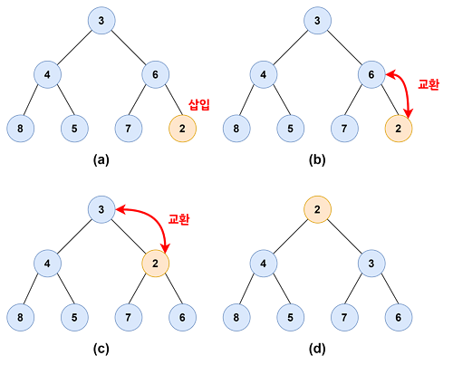
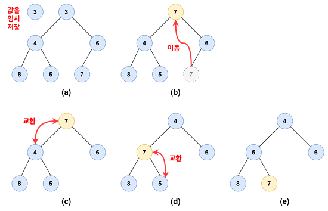

> 큐(Queue)는 선입선출(First In, First Out, FIFO)의 자료 구조로, 먼저 들어온 데이터가 먼저 나간다.
>
> 하지만 우선순위가 있는 작업에서는 큐의 기본 원칙을 따르지 않을 때가 있다. 우선순위 큐(Priority Queue) 는 들어온 순서와 상관없이 우선순위가 높은 데이터가 먼저 나가는 자료 구조다.

# 힙 (Heap)

힙(Heap)은 우선순위 큐를 구현하기 위한 자료 구조다. 힙의 뜻을 살펴보면, "쌓아 올린 더미" 또는 "쌓아 올리다"라는 의미를 가진다.

## 힙의 종류

### 최대 힙(max heap)

- 부모 노드의 키 값이 자식 노드의 키 값보다 크거나 같은 완전 이진 트리
- 부모 노드 ≥ 자식 노드

### 최소 힙(min heap)

- 부모 노드의 키 값이 자식 노드의 키 값보다 작거나 같은 완전 이진 트리
- 부모노드 ≤ 자식 노드

## 파이썬의 heapq 모듈 구현하기

파이썬에서는 heapq 모듈은 배열(리스트)을 이용하여 완전 이진트리를 구현한다. 완전 이진트리는 왼쪽부터 빈 공간 없이 차례대로 채워지기 때문에, 배열을 이용하여 효율적으로 관리할 수 있다.

```
 규칙 1: 노드를 왼쪽에서 오른쪽으로 하나씩 빠짐없이 채워나간다. (레벨 순서로 노드를 삽입한다.)

 규칙 2: 최소 힙은 부모 노드가 자식 노드의 값보다 작거나 같아야 한다. 파이썬의 heapq 모듈은 최소 힙(min heap)이다. (최대 힙은 부모 노드가 자식 노드의 값보다 크거나 같다.)
```

- heappush와 heappop의 시간 복잡도는 O(logN)입니다

### 1. heappush 구현하기

이미 힙 구조를 가진 배열의 끝에 새로운 원소를 넣는 함수다. 이때 추가된 원소가 부모보다 작으면 (최소) 힙 구조가 아니므로, 부모와 자리를 바꾼다. 물론 위로 올라간 원소가 그 위의 부모보다 작다면 계속 자리를 바꾼다.


```
(a) 가장 끝에 2를 넣는다.
(b) 2가 부모인 6보다 작으므로 서로 자리를 바꾼다.
(c) 위로 올라간 2가 부모인 3보다 작으므로, 또 자리를 바꾼다.
(d) 힙의 성질을 만족했으므로, 끝낸다.
```

- 배열(리스트) 끝에 새 값을 추가한다.
- 추가한 원소의 인덱스를 구한다.
- 부모 인덱스를 구하여 값을 비교한다.
- 새 값이 부모의 값보다 작으면 값을 교환한다.
- 인덱스를 갱신한다. (자리를 바꿨으므로, 새로 추가한 값의 인덱스가 변했다.)
- 3번으로 돌아가서 같은 과정을 반복하되, 루트에 도달하면 종료한다.
- 새 값이 부모의 값보다 크거나 같으면 종료한다.

### ✅ 코드

```
def heappush(heap, data):
    heap.append(data)
    # 추가한 원소의 인덱스를 구한다.
    current = len(heap) - 1
    # 현재 원소가 루트(인덱스 0)에 도달하면 종료
    while current > 0:
        # 추가한 원소의 부모 인덱스를 구한다.
        parent = (current - 1) // 2
        if heap[parent] > heap[current]:
            heap[parent], heap[current] = heap[current], heap[parent]
            # 추가한 원소의 인덱스를 갱신한다.
            current = parent
        else:
            break


#테스트 코드
import heapq
h1 = [3, 4, 6, 8, 5, 7]
h2 = [3, 4, 6, 8, 5, 7]
heappush(h1, 2)
heapq.heappush(h2, 2)
print(f"힙 {h1}에 2를 추가한 결과")
print("구현한 함수의 결과: ", h1)
print("heapq 메서드의 결과:", h2)
print()
heappush(h1, 3)
heapq.heappush(h2, 3)
print(f"힙 {h1}에 3을 추가한 결과")
print("구현한 함수의 결과: ", h1)
print("heapq 메서드의 결과:", h2)
```

### ✅ 실행 결과

```
힙 [2, 4, 3, 8, 5, 7, 6]에 2를 추가한 결과
구현한 함수의 결과:  [2, 4, 3, 8, 5, 7, 6]
heapq 메서드의 결과: [2, 4, 3, 8, 5, 7, 6]

힙 [2, 3, 3, 4, 5, 7, 6, 8]에 3을 추가한 결과
구현한 함수의 결과:  [2, 3, 3, 4, 5, 7, 6, 8]
heapq 메서드의 결과: [2, 3, 3, 4, 5, 7, 6, 8]
```

### 2. heappop 구현하기



```
(a) 루트 노드의 값 3을 임시 저장한다.
(b) 마지막 노드인 7을 루트로 옮긴다.
(c) 루트 노드 7을 자식 노드인 4와 6 중에서 작은 값인 4와 자리를 바꾼다.
(d) 다시 7을 자식 노드인 8과 5 중에서 작은 값인 5와 자리를 바꾼다.
```

- heap이 비었으면 "Empty Heap!"을 반환하고 종료
- 루트 노드만 있으면. pop한 값을 반환하고 종료
- 루트 노드의 값을 임시 저장한다.
- 루트 노드에 heap에서 pop한 마지막 값을 넣는다.
- 현재 노드와 자식 노드의 인덱스로 0, 1을 대입한다. (루트 노드의 인덱스, 왼쪽 자식의 인덱스)
- 자식 노드의 인덱스가 heap의 길이보다 작으면 반복한다.
  - 오른쪽 노드의 인덱스를 구한다.
  - 현재의 노드의 값을 왼쪽과 오른쪽 자식의 값과 비교한다.
  - 현재 노드의 값이 자식 노드의 값보다 크면 더 작은 자식 노드와 서로 교환한다.
    - 현재 노드의 인덱스를 갱신하고, 왼쪽 자식 노드의 인덱스를 구한다.
  - 현재 노드의 값이 자식 노드보다 작으면 반복문을 벗어난다.

### ✅ 코드

```
def heappop(heap):
    if not heap:
        return "Empty Heap!"
    elif len(heap) == 1:
        return heap.pop()

    pop_data, heap[0] = heap[0], heap.pop()
    current, child = 0, 1
    while child < len(heap):
        sibling = child + 1
        if sibling < len(heap) and heap[child] > heap[sibling]:
            child = sibling
        if heap[current] > heap[child]:
            heap[current], heap[child] = heap[child], heap[current]
            current = child
            child = current * 2 + 1
        else:
            break
    return pop_data


#테스트 코드
import heapq
h1 = [3, 4, 6, 8, 5, 7]
h2 = [3, 4, 6, 8, 5, 7]
print(f"힙 {h1}에서 pop한 결과\n")
data1 = heappop(h1)
data2 = heappop(h2)
print("구현한 함수 pop data =", data1)
print("구현한 함수 pop 이후: ", h1)
print()
print("heapq 함수 pop data =", data2)
print("heapq 함수 pop 이후: ", h2)
```

### ✅ 실행 결과

```
힙 [3, 4, 6, 8, 5, 7]에서 pop한 결과

구현한 함수 pop data = 3
구현한 함수 pop 이후:  [4, 5, 6, 8, 7]

heapq 함수 pop data = 3
heapq 함수 pop 이후:  [4, 5, 6, 8, 7]
```

## heappush와 heappop 테스트

### ✅ 코드

```
h = []
arr = [21, 33, 17, 27, 9, 11, 14]
for i in arr:
    heappush(h, i)

print(f"배열의 상태: {arr}\n")
print(f"배열의 모든 원소를 힙에 push한 상태: {h}\n")
print("힙에서 모든 원소를 pop한 결과:", end = " ")
while h:
    print(heappop(h), end = " ")
print(f"\n\n빈 힙에서 원소를 pop한 결과: {heappop(h)}")
```

### ✅ 실행 결과

```
배열의 상태: [21, 33, 17, 27, 9, 11, 14]

배열의 모든 원소를 힙에 push한 상태: [9, 17, 11, 33, 27, 21, 14]

힙에서 모든 원소를 pop한 결과: 9 11 14 17 21 27 33

빈 힙에서 원소를 pop한 결과: Empty Heap!
```
