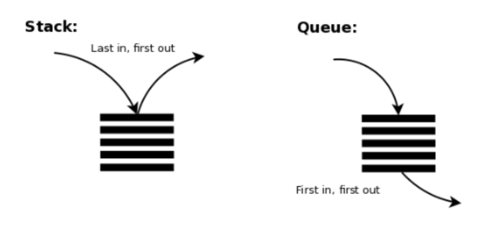

# Stack

- 먼저 들어 온 데이터가 나중에 나가는 형식(선입후출)의 자료구조 : LIFO
- 입구와 출구가 동일한 형태로 스택을 시각화할 수 있음 ex) 프링글스

</br>

> 스택 구현 예제 - append 사용

```
stack = []

 삽입(5) - 삽입(2) - 삽입(3) - 삽입(7) - 삭제() - 삽입(1) - 삽입(4) - 삭제()
stack.append(5)
stack.append(2)
stack.append(3)
stack.append(7)
stack.pop()
stack.append(1)
stack.append(4)
stack.pop()

print(stack[::-1]) # 최상단 원소부터 출력
print(stack)

# 출력
#[1,3,2,5] -> 스택 구현
#[5,2,3,1] -> stack의 인덱스 0부터 차례로 출력
```

</br>

# Queue

- 먼저 들어온 데이터가 먼저 나가는 형식(선입선출)의 자료구조 : FIFO
- 큐는 입구와 출구가 모두 뚫려 있는 터널과 같은 형태로 시각화할 수 있음
  > 큐 구현 예제 - deque 사용

```
from coolections import deque

# 큐 구현을 위해 deque 라이브러리 사용

# 삽입(5) - 삽입(2) - 삽입(3) - 삽입(7) - 삭제() - 삽입(1) - 삽입(4) - 삭제()
queue.append(5)
queue.append(2)
queue.append(3)
queue.append(7)
queue.popleft()
queue.append(1)
queue.append(4)
queue.popleft()

print(queue) # 먼저 들어온 순서대로 출력 -> 큐 구현
queue.reverse
print(queue) # 나중에 들어온 원소부터 출력

#출력
# deque([3,7,1,4])
# deque([4,1,7,3])
```
